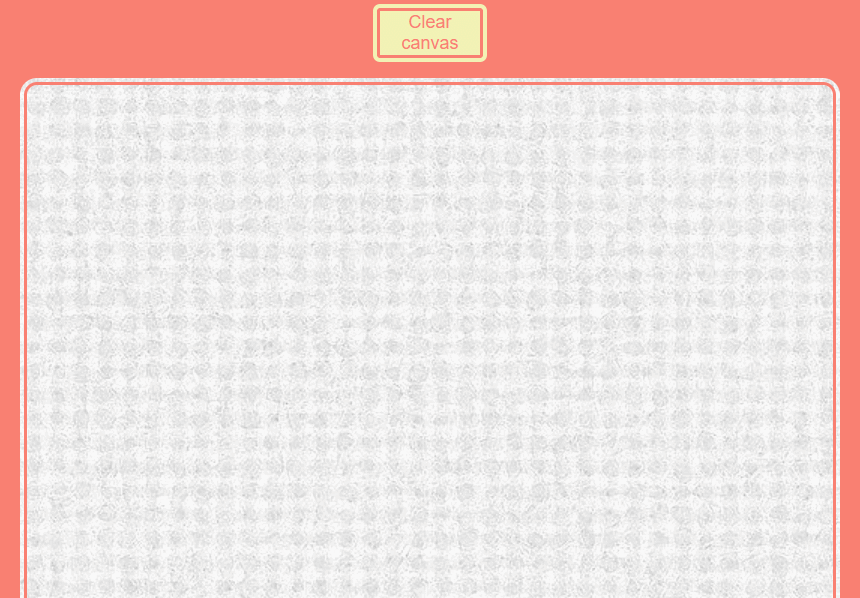

# [Wes Bos' 30 days Vanilla JS challenge](https://javascript30.com/)

## `No frameworks, no compilers, no fuss;`

### **[Day 08: Fun with HTML `<canvas>`](https://2y2son4.github.io/fun-with-canvas/)**.

#### **JS**

- [HTMLCanvasElement.getContext()](https://developer.mozilla.org/en-US/docs/Web/API/HTMLCanvasElement/getContext)
  - [CanvasRenderingContext2d](https://developer.mozilla.org/en-US/docs/Web/API/CanvasRenderingContext2D)
    - [strokeStyle](https://developer.mozilla.org/en-US/docs/Web/API/CanvasRenderingContext2D/strokeStyle)
    - [lineJoin](https://developer.mozilla.org/en-US/docs/Web/API/CanvasRenderingContext2D/lineJoin)
    - [lineCap](https://developer.mozilla.org/en-US/docs/Web/API/CanvasRenderingContext2D/lineCap)
    - [lineWidth](https://developer.mozilla.org/en-US/docs/Web/API/CanvasRenderingContext2D/lineWidth)
    - [.beginPath()](https://developer.mozilla.org/en-US/docs/Web/API/CanvasRenderingContext2D/beginPath)
    - [.moveTo()](https://developer.mozilla.org/en-US/docs/Web/API/CanvasRenderingContext2D/moveTo)
    - [.lineTo()](https://developer.mozilla.org/en-US/docs/Web/API/CanvasRenderingContext2D/lineTo)
    - [.stroke()](https://developer.mozilla.org/en-US/docs/Web/API/CanvasRenderingContext2D/stroke)
  - [.toDataURL()](https://developer.mozilla.org/en-US/docs/Web/API/HTMLCanvasElement/toDataURL)
- [Element.getBoundingClientRect()](https://developer.mozilla.org/en-US/docs/Web/API/Element/getBoundingClientRect)
- [Window.open()](https://developer.mozilla.org/en-US/docs/Web/API/Window/open)

Click here to check the <strong>result</strong>.

